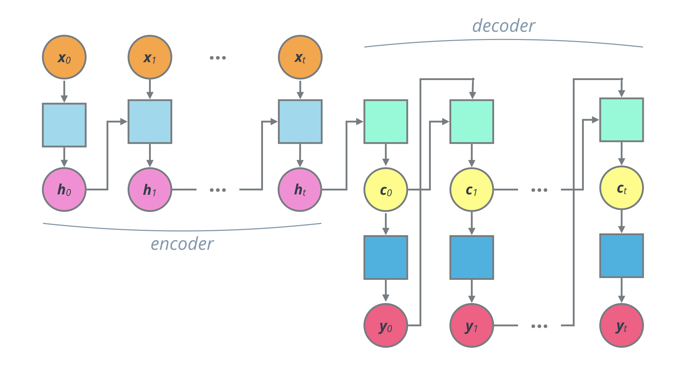

# Machine Translation

In this project, we build a deep neural network that functions as part of a machine translation pipeline using [Keras](https://keras.io/). The pipeline accepts English text as input and returns the French translation. The goal is to achieve the highest translation accuracy possible.

### RNN 


RNNs are designed to take sequences of text as inputs or return sequences of text as outputs, or both. They're called recurrent because the network's hidden layers have a loop in which the output from one time step becomes an input at the next time step. This recurrence serves as a form of memory. It allows contextual information to flow through the network so that relevant outputs from previous time steps can be applied to network operations at the current time step.


### Encoder-Decoder


The encoder summarizes the input into a context variable, also called the state. This context is then decoded and the output sequence is generated.Since both the encoder and decoder are recurrent, they have loops which process each part of the sequence at different time steps. To picture this, it's best to unroll the network so we can see what's happening at each time step.


### Model
```python
def model_final(input_shape, output_sequence_length, english_vocab_size, french_vocab_size):
    learning_rate = 2e-3
    
    model = Sequential()
    
    # Embedding
    model.add(Embedding(french_vocab_size, 200, input_length=input_shape[1]))
    
    # Encoder
    model.add(Bidirectional(GRU(128)))
    model.add(RepeatVector(output_sequence_length))
    
    # Decoder
    model.add(Bidirectional(GRU(128, return_sequences=True)))
    model.add(TimeDistributed(Dense(512, activation='relu')))
    model.add(Dropout(0.5))
    model.add(TimeDistributed(Dense(french_vocab_size, activation='softmax')))
    
    
    model.compile(loss=sparse_categorical_crossentropy,
                  optimizer=Adam(learning_rate),
                  metrics=['accuracy'])
    
    return model
```

_Images credits: [Udacity](www.udacity.com)_