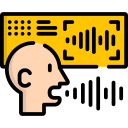

# Udacity Natural Language Processing Nanodegree
Projects completed under [Udacity's Natural Language Processing nanodegree](https://www.udacity.com/course/natural-language-processing-nanodegree--nd892) program.

## Project-1: [Part of Speech Tagging](https://github.com/cloud-VG/Udacity-Natural-Language-Processing-Nanodegree/tree/master/Part%20of%20Speech%20Tagging)

In this project we build a hidden Markov model for part of speech tagging with a [universal tagset](http://www.petrovi.de/data/universal.pdf) using the [Pomegranate](https://github.com/jmschrei/pomegranate) library. 

## Project-2: [Machine Translation](https://github.com/cloud-VG/Udacity-Natural-Language-Processing-Nanodegree/tree/master/Machine%20Translation)

In this project, we build a deep neural network that functions as part of a machine translation pipeline using [Keras](https://keras.io/). The pipeline accepts English text as input and returns the French translation. The goal is to achieve the highest translation accuracy possible.

## Project-3: [Speech Recognizer](https://github.com/cloud-VG/Udacity-Natural-Language-Processing-Nanodegree/tree/master/VUI%20Speech%20Recognizer)

In this project we build deep neural networks using [Keras](https://keras.io/) that functions as part of an end-to-end automatic speech recognition (ASR) pipeline! The completed pipeline will accept raw audio as input and return a predicted transcription of the spoken language. In this capstone project, 5 RNN architectures are used and compared with each other.

_Images credits: [Flaticon](https://www.flaticon.com/)_